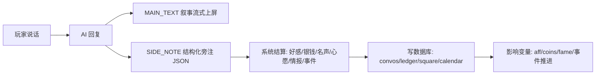

# 豆花庄 · 大地图信息台设计 v2（参考 jihaitang《姬侠传/瀚海》SLG）

> 大改版：从"四件古风物件"升级为"**一张大地图 + 七个活地点**"。
> 机制学 jihaitang：地点状态化（后台 LLM 演化）、说话改变量（结构化旁注结算）、周轮换新鲜事。
> 界面延续墨蓝古风；移动端复用抽屉体系。

## 一、大地图

一张新地图（复用现有 map-frame/pin 组件，新背景图或沿用），七个地点：

| 地点 | 功能 | 每周新鲜事示例 |
|---|---|---|
| 🏠 **豆花庄（家）** | 账本 · 黄历（夜间对账） | 灶王爷托梦、苏唐想学新菜 |
| 🏮 **广场** | 聊天 · 买卖 · 邸报 | 布贩打折、谁家丢牛、官差贴告示 |
| 🎭 **瓦舍** | 说书 · 戏台 · 喝酒 | 新话本开讲、戏班来巡演、酒友攒局 |
| ⚔️ **擂台** | 比武挑战 | 关中刀客来挑场、赏格翻倍 |
| 🎎 **红白堂** | 红事/白事宴席 | 王员外嫁女、老猎户白事 |
| 🏯 **土司府** | 土司宴席 · 差事 | 土司寿宴、征粮差事 |
| 🌲 **探秘点**（现有 10 点保留） | 寻料 | 照旧 |

- 地图上每个地点显示**本周新鲜事标记**（有新事 → 地点冒个点/铃铛）。
- 点击地点 → 地点页（不是弹窗列表，是地点内部视图）。

## 二、地点 = 活的状态（学 location-runner）

每个地点是一个**状态对象**，会随时间演化：

```js
st.locs[locId] = {
  name, desc,
  vibe: "热闹/冷清/紧张…",        // 氛围（AI 后台演化）
  danger: 0-100, favor: 0-100,     // 危险度/友善度（数值系统）
  fresh: { week, title, desc, npc, done, kind },  // 本周新鲜事（AI 生成，数值系统定）
  people: [npcIds],                // 常驻/本周在场 NPC
  seen: day,                       // 上次访问
};
```

**演化机制**：
- **周初 roll**：每周一（下一日翻篇）为每个地点生成/轮换新鲜事（AI 一次批量出 6 条事件卡，想象归 AI；数值归系统）。
- **访问后更新**（jihaitang location-runner 范式）：玩家离开某地点后，把本次互动摘要喂后台 LLM，**更新该地点的氛围/危险度/友善度/下周新鲜事种子**——地点真在"活"。
- 不强制：每周每个地点**不一定**有新任务，但随时可进去看/聊/互动（氛围和 NPC 常在）。

## 三、说话改变量（核心，学 response-parser + variable-system）

**所有互动（聊天/讨价/打赏/搭话）走同一条流水线**：



- **SIDE_NOTE 协议**（AI 每轮必须输出，系统只认数值，文字无效）：
  ```json
  {"aff": {"余味": 2}, "coins": -5, "fame": 1,
   "wish": "想吃鱼", "info": "城西新开酒楼", "event": null,
   "mood": "开心", "done": false}
  ```
- **系统强校验**：aff 限 ±3/轮、coins 范围由场景定、wish 走现有心愿系统、info 进广场流、event 非空则排队成事件。
- 聊天全程进 `st.convos[npcId]` 线程（数据库），AI 回复时注入该线程上下文——**聊过的话都算数**。

## 四、各地点交互

### 🏠 家（豆花庄）
- **黄历**：每日一页（节气/大事/收支/心情）；夜间对账——苏唐 AI 复盘 + 玩家回话（+suAff）。
- **账本**：流水 ledger（自动记账）+ 各册（菜谱/星料/酒库/待客）翻页浏览。

### 🏮 广场
- **聊天**：广场流（布告墙，回响/事件自动上墙）+ 私聊（信纸，NPC 线程，好感解锁）。
- **买卖**：集市摊（按周轮换的货物/星料/打折），讨价 → 口才检定 → 成/败（说话改变量）。
- **邸报**：官方/江湖新闻（genEcho 邸报文体），读报 +名声。

### 🎭 瓦舍
- **说书**：说书先生讲江湖故事（话本文体），打赏 → 名声 + 银钱-；可点单（影响下段内容）。
- **戏台**：戏班把近期事迹唱成戏（戏文体），散场观众打赏。
- **喝酒**：围炉，和在场 1-3 位常客喝酒闲谈（群聊 AI），酒后吐真言 → 情报/好感。

### ⚔️ 擂台 / 🎎 红白堂 / 🏯 土司府
- 每周新鲜事给任务卡（挑战/宴席/差事），接活 → 玩法（检定/备菜/跑腿）→ 结算 → 流水/广场/黄历联动。

## 五、数据库（新增字段）

```js
st.locs = {};          // 地点状态（含 fresh 新鲜事）
st.convos = {};        // 私聊线程 { npcId: [{who, text, day, ts}] }
st.square = [];        // 广场流
st.ledger = [];        // 流水账
st.calendar = [];      // 黄历页
st.theater = [];       // 演出记录
st.fame = 0;           // 名声（新全局变量，店誉联动）
st.eventQueue = [];    // 事件队列（擂台/红白/土司任务卡）
```
整存 localStorage，读档兼容缺省。

## 六、实现顺序

1. **流水线地基**：SIDE_NOTE 协议 + 结算器（说话改变量的骨架）+ convos 数据库
2. **大地图 + 地点页**（家/广场/瓦舍/三特殊点，复用 map 组件）
3. **周初 roll + 新鲜事生成**（genEvent 批量出卡）
4. **广场**（聊天/买卖/邸报）→ **瓦舍**（说书/戏台/喝酒）→ **家**（黄历对账/账本）
5. **三特殊点玩法**（擂台检定/红白宴/土司宴）+ 后台地点演化（location-runner 式）
6. 移动端收尾 + 全量测试

## 七、可行性

jihaitang 已验证全部机制（地点演化/旁注结算/周摘要/回滚），豆花庄现有素材（文体生成/检定/好感/回响）可复用。工作量：流水线 + 地图 + 6 个地点页 + 3 个玩法，分期可交付。
